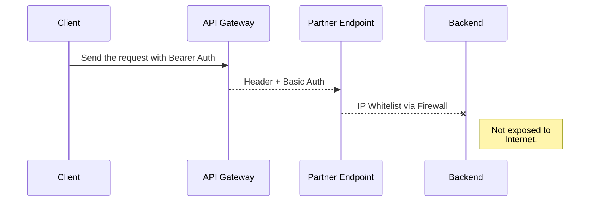

## API Projects Category

There are some APIs projects archetypes that we have been noticing:
-   The customer has Zero APIs,
-   The customer has some APIs that you have just to do some proxy
-   The customer has a bunch of APIs and you have to do compositions or orchestrations with them
-   Customers asking about: What about this new GraphQL momentum

### Customer has Zero APIs

That is the scenario where you will have to do important architectural decisions, from adopting a programming language, a platform, a framework, or all together.
To understand the existing technology that exists in the customer is crucial do define how you will build your Endpoints.

If you had decided to adopt a Microservice Architecture style, keep in mind that you will face not only programming and new paradigms, but also infrastructure challenges, as your customer will at a certain level to embrace numerous new concepts such as CI/CD pipelines, containers, Kubernetes so for so forth.

At Skalena we always decided to start with ***Quick wins***, it means, not start with dramatic changes and to do the things in a very controlled pace. Therefore, if you have a savvy customer ahead, great to move the things in a fast way, but we do believe to do the things in according to **Agile** principles is safer.

### Customer has some APIs that you have just to Proxy 

That is a common scenario when companies are moving towards digital, they get first an *[API Gateway Pattern](https://microservices.io/patterns/apigateway.html)* to act as a central proxy, where you can use it as a unique point for Authentication controlling, as well as some analytics, tracing and monitoring. That is a moment, where just an API Gateway shall be enough for you. 

What is important in that point is to understand how you will interact with your client requests, which HTTP headers you should care about, does your payload response must be enriched, changed etc.  In that scenario, we extremelly recommend you establish a very simple sequence diagram in order to communicate with your customers, things like the following ones: 

Simple diagrams like that, can save your time and the communication will be opener

### Customer with APIs: Compositions or orchestrations 

To-Do

### Customers asking about: What about this new GraphQL momentum

To-do

