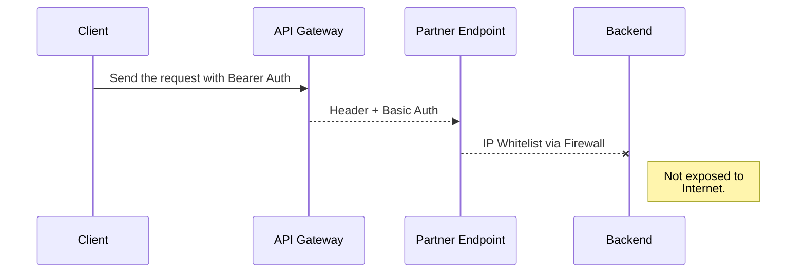
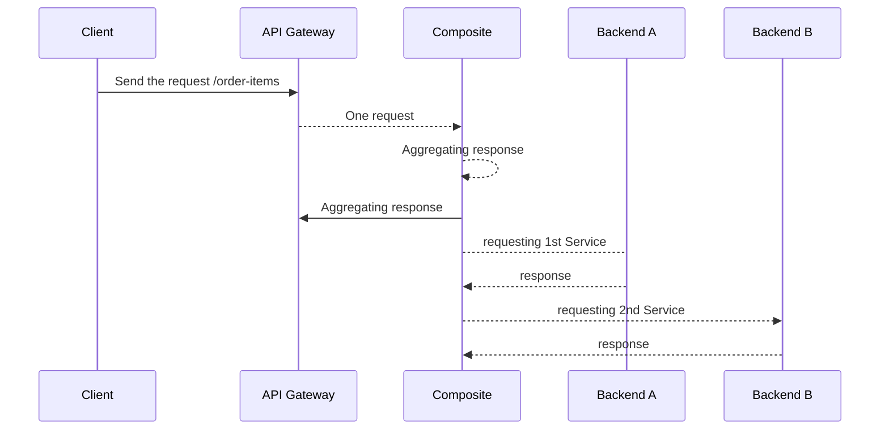

## API Projects Category

There are some APIs projects archetypes that we have been noticing:

- The customer has Zero APIs,
- The customer has some APIs that you have just to do some proxy
- The customer has a bunch of APIs and you have to do compositions or orchestrations with them
- Customers asking about: What about this new GraphQL momentum

### Customer has Zero APIs

That is the scenario where you will have to do important architectural decisions, from adopting a programming language, a platform, a framework, or all together.
To understand the existing technology that exists in the customer is crucial do define how you will build your Endpoints.

If you had decided to adopt a Microservice Architecture style, keep in mind that you will face not only programming and new paradigms, but also infrastructure challenges, as your customer will at a certain level to embrace numerous new concepts such as CI/CD pipelines, containers, Kubernetes so for so forth.

At Skalena we always decided to start with **_Quick wins_**, it means, not start with dramatic changes and to do the things in a very controlled pace. Therefore, if you have a savvy customer ahead, great to move the things in a fast way, but we do believe to do the things in according to **Agile** principles is safer.

### Customer has some APIs that you have just to Proxy

That is a common scenario when companies are moving towards digital, they get first an _[API Gateway Pattern](https://microservices.io/patterns/apigateway.html)_ to act as a central proxy, where you can use it as a unique point for Authentication controlling, as well as some analytics, tracing and monitoring. That is a moment, where just an API Gateway shall be enough for you.

What is important in that point is to understand how you will interact with your client requests, which HTTP headers you should care about, does your payload response must be enriched, changed etc. In that scenario, we extremelly recommend you establish a very simple sequence diagram in order to communicate with your customers, things like the following ones:

Simple diagrams like that, can save your time and the communication will be opener

### Customer with APIs: Compositions or orchestrations

It is something very common that you might have ready services/backends, but you must have to do that we call: composite APIs, which means through a unique call to invoke several endpoints right a once.

In those scenarios, we have a few options:

- Build a composite Microservice/Service
- To Use Integration platforms/frameworks, such as WSO2, Apache Camel, Kafka Connectors, or proprietary solutions.

Either scenario would have its drawbacks and advantages, although in our methodology we actually have a preference for the Integrations frameworks/platforms due to productivity and some code generating techniques that we have in place.

Imagine the following scenario:

Furthermore, to simply compose services based on existing backends, many other aspects might be intrinsically involved, for instance:

a) Backends developed by different companies or partners might treat authentication and authorization differently.

b) If you have a set of services, and you have to invoke them all, what happened if some of those fails? In that regard, your new composite service must treat that anyhow. We can use techniques related to [circuit-breakers](https://microservices.io/patterns/reliability/circuit-breaker.html), or simply to define timeouts, according to the use cases, sometimes you can have partial responses (the data coming from responsive backends) and ignore the one that has failed, or there are cases, where it is "all or nothing" if any of the services does not respond, you can send an [HTTP error code with a fault](https://www.restapitutorial.com/httpstatuscodes.html#), and making sure that you point which were the service that did not respond properly.

### Customers asking about: What about this new GraphQL momentum

To-do
