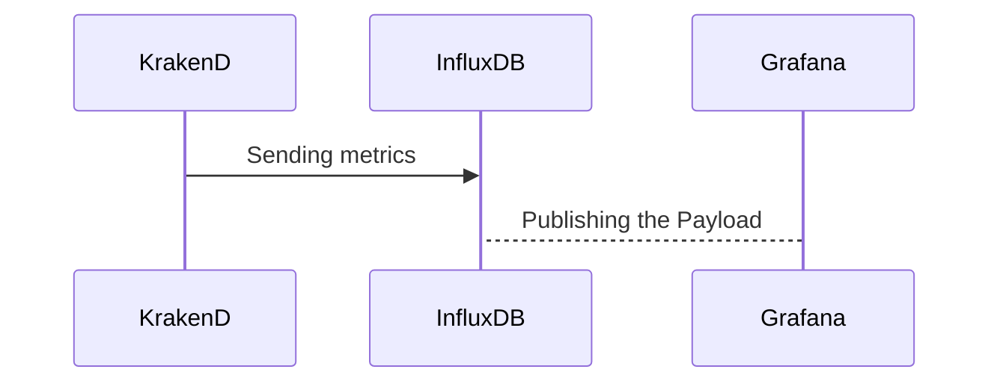

## Objective
We will show the following topics: 
* Execute InfluxDB via Docker
* Running InfluxDB CI
* Running Grafana
* Publishing metrics from KrakenD API invocations

###  Running InfluxDB via Docker

Please, execute the following Docker command:

    docker run -p 8086:8086 -e INFLUXDB_DB=krakend -e INFLUXDB_USER=letgo -e INFLUXDB_USER_PASSWORD=pas5w0rd -e INFLUXDB_ADMIN_USER=admin -e INFLUXDB_ADMIN_PASSWORD=supersecretpassword -it --name=influx influxdb

This container will expose InfluxDB using the port 8086, and there is a database created called *krakend*

In order to test InfluxDB, if everything is running, please execute the following cURL comand: 

    curl -G [http://localhost:8086/query](http://localhost:8086/query) --data-urlencode "q=SHOW DATABASES"

The return should be the the following one:

    {"results":[{"statement_id":0,"series":[{"name":"databases","columns":["name"],"values":[["krakend"],["_internal"]]}]}]}  

As you can notice, it returns the database krakend, created originally on the first step, which wil be used to store the metrics sent by KrakenD API Gateway.

### Running Grafana

Please, run the following docker command:

    docker run -d -p 3000:3000 --name=grafana grafana/grafana 

If you go to the browser and open  [http://localhost:3000](http://localhost:3000/), you will be able to see the Grafana Login Page, you can use admin for both user and password:

#### Adding the InfluxDB Datasource in Grafana

From the main home screen, check the box ***DATASOURCES***, and please click on *Add your first Data Source*. Select the InfluxDB as your time series database, and add the following information:

 -  URL: http://localhost:8086
 -  Access: browser
 -  database: krakend
 -  password: supersecretpassword
 -  HTTP Method : GET

Done! Datasource ready to get data from InfluxDB.

#### Importing the KrakenD Dashboard to Grafana

Well, you might think: "Now, I have to create the dashboard", but, the KrakenD Engineering, already let a ready dashboard available for you: [https://grafana.com/grafana/dashboards/5722](https://grafana.com/grafana/dashboards/5722). The most important information at this point is that you "ready dashboard" for krakenD has the ID 5722:

After to click on Load button, you will see the following screen:

Please, make sure that you had selected the Influx information, and then click on Import button. At the first look, the dashboard will present no data, obviously because, we haven't sent any information yet to InfluxDB, so let's go the last part of this chapter.

### Testing 

We have created the following KrakenD config file named as krakend.json: 

    {
        "version": 2,
        "extra_config": {
            "github_com/letgoapp/krakend-influx": {
                "address": "http://localhost:8086",
                "ttl": "10s",
                "buffer_size": 0
            },
            "github_com/devopsfaith/krakend-metrics": {
                "collection_time": "10s",
                "listen_address": "127.0.0.1:8090"
            }
        },
        "timeout": "3000ms",
        "cache_ttl": "300s",
        "output_encoding": "no-op",
        "name": "GrafanaAPIs",
        "endpoints": [{
            "endpoint": "/uuid",
            "method": "GET",
            "output_encoding": "no-op",
            "extra_config": {},
            "backend": [{
                "url_pattern": "/uuid",
                "encoding": "no-op",
                "sd": "static",
                "method": "GET",
                "extra_config": {},
                "host": [
                    "https://httpbin.org"
                ],
                "disable_host_sanitize": false
            }]
        }]
    }

This ***krakend.json*** config file has the whole configuration in order to send the metrics to InfluxDB, here are these particular configs:

    "extra_config": {
    
        "github_com/letgoapp/krakend-influx": {
        
        "address": "http://localhost:8086",
        
        "ttl": "10s",
        
        "buffer_size": 0
        
        },
        
        "github_com/devopsfaith/krakend-metrics": {
        
        "collection_time": "10s",
        
        "listen_address": "127.0.0.1:8090"
        
        }
        
        },

Please, chose your preferred way to execute krakend, [it might be several ones](https://www.krakend.io/docs/overview/installing/), in our case, we do have the installed binary, so we will run the command: `krakend run -c krakend.json` 

The log will show that InfluxDB is activated:

    2020/11/19 20:58:21 DEBUG: http-server-handler: no extra config
    
    2020/11/19 20:58:21 DEBUG: influx ping results: duration = 32.216439ms msg = 1.8.3
    
    2020/11/19 20:58:31 DEBUG: Preparing influxdb points
    
    2020/11/19 20:58:31 DEBUG: no metrics to send to influx
    
    2020/11/19 20:58:41 DEBUG: Preparing influxdb points
    
    2020/11/19 20:58:41 INFO: 16 datapoints sent to Influx

### Some Loading Testing

We love this tool: Hey(https://github.com/rakyll/hey), which is a pretty easy HTTP Load testing tool. 

We will execute 1200 requests now, and check how KrakenD will process this volume:

    hey -n 1200 http://localhost:8080/uuid

Here the results:

    Latency distribution:
    
    10% in 0.1441 secs
    
    25% in 0.1465 secs
    
    50% in 0.1500 secs
    
    75% in 0.1534 secs
    
    90% in 0.1629 secs
    
    95% in 0.5674 secs
    
    99% in 0.6986 secs
    
      
    
    Details (average, fastest, slowest):
    
    DNS+dialup:  0.0003 secs, 0.1389 secs, 1.2797 secs
    
    DNS-lookup:  0.0001 secs, 0.0000 secs, 0.0036 secs
    
    req write:  0.0000 secs, 0.0000 secs, 0.0013 secs
    
    resp wait:  0.1846 secs, 0.1389 secs, 1.2682 secs
    
    resp read:  0.0001 secs, 0.0000 secs, 0.0024 secs
    
      
    
    Status code distribution:
    
    [200]  1200 responses

Please, check the `KrakenD log`, and then take a look into Grafana Dashboard again:

Have fun with! And if you need some help, please reach us at: https://skalena.com.br

